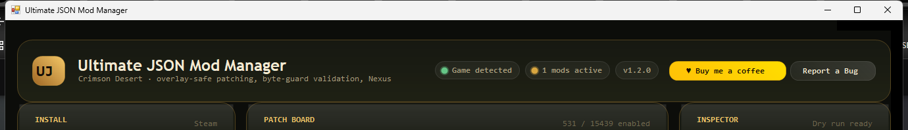
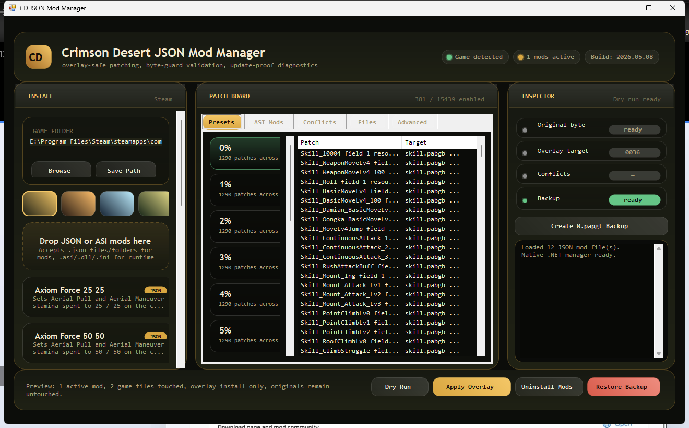
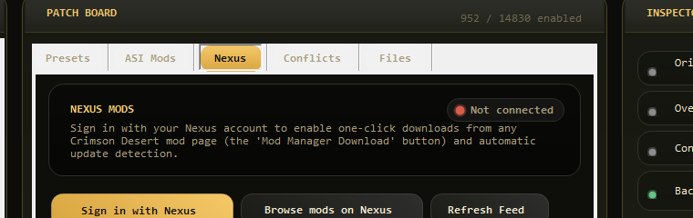

# Ultimate JSON Mod Manager (UJMM)

A specialized JSON byte-patch mod manager for **Crimson Desert**.

Imports `.json` patch definitions and `.asi/.dll/.ini` runtime hooks, validates byte guards against the live game files, and applies overlay patches without modifying the original game archives. Companion tool to existing managers — focused on the JSON patch format used by the Crimson Desert modding community.



## Features

- **Drag-and-drop import** for `.json`, `.asi`, `.dll`, `.ini` files. Auto-routes by extension (JSON → `mods/`, runtime → `bin64/`).
- **Preset rail** that scopes to your active mod selection — clicking a preset (`0%`, `5%`, `25%`, `100%` …) sets every selected mod to that level in one click.
- **Multi-select mod cards** with visible checkboxes and instant patch preview.
- **Byte-guard verify** — `Verify Bytes` runs the original-byte guards from each selected mod against your installed `0008/0.pamt` + `.paz` archives. Catches stale offsets, half-patched files, and wrong game versions before you apply anything.
- **0.papgt backup / restore** — protects the registration file before every overlay write.
- **ASI loader management** — detects Ultimate ASI Loader in `bin64`, lists installed plugins, enable/disable per file.
- **Nexus integration** (pending Nexus app registration):
  - One-click sign-in via the standard Nexus SSO flow — no API key paste, no password.
  - `nxm://` protocol handler — click *Mod Manager Download* on any Crimson Desert Nexus mod page and the file lands here automatically.
  - Per-mod update detection — sidecar files track installed version; a 30-min poller flags new releases with a red "UPDATE" pill on the mod card.
- **Auto-updater for the manager itself** — polls GitHub Releases; one-click download + restart when a new version ships.
- **Auto crash capture + bug reports** — uncaught exceptions are sanitized (paths, tokens redacted), saved to `backups/crashes/`, and a dialog offers to open a prefilled GitHub issue.
- **Theming** — Gilded / Ember / Frost / Forest swatches, persisted across launches.



## Install

1. Download the latest `Ultimate JSON Mod Manager.exe` from [Releases](https://github.com/0xNobodyYT/ultimate-json-mod-manager/releases).
2. Drop it in any folder you like.
3. Double-click to run. On first launch the app registers itself as the handler for `nxm://` URLs (no admin prompt — uses your user profile).
4. Click **Detect** in the Install panel — it'll find your Crimson Desert install via Steam paths. If it can't, click **Browse** and pick the folder that contains `bin64\` and `0008\`.

Requires .NET Framework 4.7.2 or later (preinstalled on Windows 10 21H2 and later, and on all Windows 11).

## Use

### Adding mods

- Drop a `.json` patch file (or a folder of them) onto the dashed drop zone in the Install panel.
- Or click **Browse JSON Mods** and pick files.
- ASI/DLL/INI files dropped on the same zone get routed to `bin64/` (game folder must be set first).

### Selecting and applying

1. Tick the checkboxes on the mod cards you want active.
2. Pick a preset on the rail (e.g. `5%`, `25%`). Only presets present in your selection appear.
3. The Patch Board shows every patch that will run + the bytes it touches.
4. Click **Verify Bytes** to check the originals match your installed game without writing anything.
5. *(After overlay writer ships)* Click **Apply Mods** to install the overlay.

### Right-click any mod card

- Uninstall / Disable
- Open the mod's folder
- Link to a Nexus mod page (paste URL or mod ID — enables update tracking)
- Open on Nexus
- Delete from manager

### Nexus sign-in

Click **Sign in with Nexus** on the Nexus tab. A browser window opens, you click Approve once, and the app remembers you. No API key paste, no password.

> Until Nexus Mods finalizes app registration, the sign-in button shows a friendly "coming soon" message instead of working. Mod browsing still works.



## Build

```cmd
build.cmd
```

Produces `Ultimate JSON Mod Manager.exe`. Requires Roslyn `csc.exe` (Visual Studio Build Tools or full VS install). Set the `CSC` environment variable to point at it if it's not on `PATH`.

Targets .NET Framework 4.x with C# 7.3 language features. Single-file source at [`src/Program.cs`](src/Program.cs).

## Tech

- **WinForms** (no XAML, no third-party UI libraries)
- **PAZ archive parser + LZ4 block decompressor** built in — handles the Crimson Desert archive format directly
- **Custom-painted controls** for the gilded panels, pills, gradient buttons, brand mark
- **TLS 1.2** enforced for all HTTPS calls
- **Single-instance** via named mutex; secondary instances forward `nxm://` URLs to the primary via `WM_COPYDATA`
- **Crash sanitizer** redacts user paths and Nexus key patterns from any data leaving the machine

## License

MIT — see [LICENSE](LICENSE).

## Support

If this tool helps you, [buy me a coffee](https://buymeacoffee.com/0xNobody) ☕

## Bug reports

Click **Report a Bug** in the app — it auto-collects sanitized diagnostics and opens a prefilled issue here.

Or [open an issue manually](https://github.com/0xNobodyYT/ultimate-json-mod-manager/issues/new).
